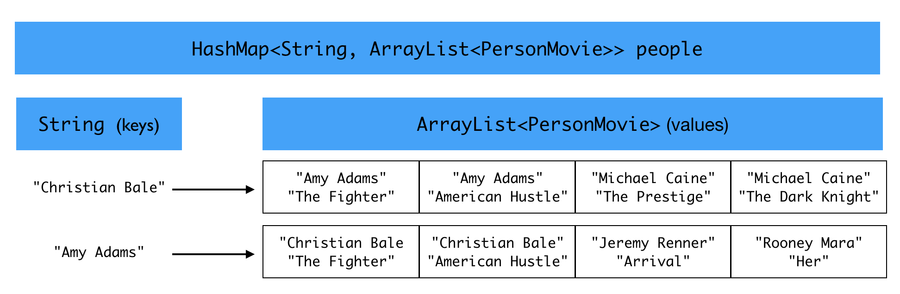

# Problem Set 10: Six Degrees of Separation

### Due Thursday, May 2nd @ 11.59pm

---

## Overview

At long last, you have arrived at the final problem set for CS2! In this problem set, you will be exploring a undirected graph built using a subset of the available data from IMDB, the Internet Movie Database. The data is stored in a text file I have provided called `imdb.txt`. It was downloaded from here: https://www.kaggle.com/PromptCloudHQ/imdb-data and modified to contain only the relevant information for this problem set.

In this graph of actors from the 999 most popular movies from 2006 to 2016, each vertex is an actor, and each edge is movie that unites that actor with another actor. Below is a visualization of a subgraph of this graph:


The graph is implemented as an adjacency list. A `HashMap` object called `people` maps a `String` key (an actor's name) to a value that is an `ArrayList` of `PersonMovie` objects. The `ArrayList` is the adjacency list for that actor. Each `PersonMovie` object in the `ArrayList` stores the name of an actor and a movie that actor was in with the key actor. Thus, for every actor, we know every other actor they starred with and the name of the movie (or movies) that brough them together. This picture might make things a bit clearer. 




Note that the same actor can appear twice in a key's adjacency list if that actor appeared in multiple movies with the key actor. For instance, the adjacency list for Christian Bale would include a `PersonMovie` object for when he starred with Amy Adams in "American Hustle" and a `PersonMovie` object for when he starred with Amy Adams in "The Fighter".

Detailed comments about the implementation can be found in the `SixDegrees.java`.

---
## Tasks

Your tasks, which increase in difficulty from the first to the last, are set out below. I have written a lot of the code for you, and it is well commented. 


### Task 1: Max and min degree
When we talk about graphs, we often like to talk about the number of edges coming out of a vertex. This is called the degree of the vertex. Write two methods with the following specifications:

```java
// print out the actor(s) with the maximum degree
public void maxDegree()

// print out the actor(s) with the minimum degree
public void minDegree()
```

This is very easy to calculate: just go through each key in the `people` instance variable and get the length of the associated `ArrayList` value. 

### Task 2: Most "popular" actors
In class we learned that taking a "random walk" on a graph can tell us about the relative popularity of a particular vertex. If you randomly follow edges in the graph of actors , you'll notice that you will visit some actors more often than others, no matter where you start off in the graph. We can say that those actors are more popular -- they are the Kevin Bacons of our graph. 

I have written code that takes a random walk starting at a given vertex (actor) and ending after a certain number of steps. The method returns an `ArrayList` of all of the actors visited on that random walk. 

Write a method with the following specification:

```java
// print out the 5 most popular actors based on number of visits in a random walk
public void mostPopular()
```

In the method, create a `HashMap` that maps from actors (a `String`) to a count of how many times they were visited on a random walk (an `Integer`). Then take 1000 random walks using the method I have provided. For each walk, randomly select a key from the `people` instance variable, and start at that actor. Then randomly select a path length between 1 and 100. Carry out that random walk using the provided method. After each random walk, add to your current tally for each actor in your `HashMap` variable. After 1000 walks, print out the top 5 most visited actors.

### Task 3: Breadth-first search (`findShortestPath()`)
You will be writing code for breadth-first search to try to connect any two actors in the graph on a shortest path. I have provided skeleton code and very detailed comments in the `SixDegrees.java` file. I've also demonstrated how to do breadth-first search in class and in example code. Have fun!

### Task 4: `main()` method and finding exceptional paths
In the main method, I've provided some calls to the existing methods and some commented-out calls to the methods you'll be writing in tasks 1, 2, and 3. Uncomment these commented-out calls to verify that your code works. Then use your code from Task 3 to try to answer these questions:

* Can you find two actors whose shortest path is longer than 4? Put a call in your main method to `findShortestPath()` with any pairs of actors you find (if any) that meet these criteria. 
* What is the longest path you can find between two actors? Put a call in your main method to `findShortestPath()` with the pair of actors whose path is very long.
* Can you find any pair of actors that are not connected at all? Put a call in your main method to `findShortestPath()` with any pairs of actors you find (if any) that meet these criteria.

--- 

## Important notes on grading

1. You should submit only the files that are already in the repo. 

2. Your code must compile. If you can't get something to compile, comment it out and explain what you were doing so we can try to give you partial credit.

3. Comment your code and indent propertly. This will be worth 10% of your grade on this problem set (i.e., 1 point).


